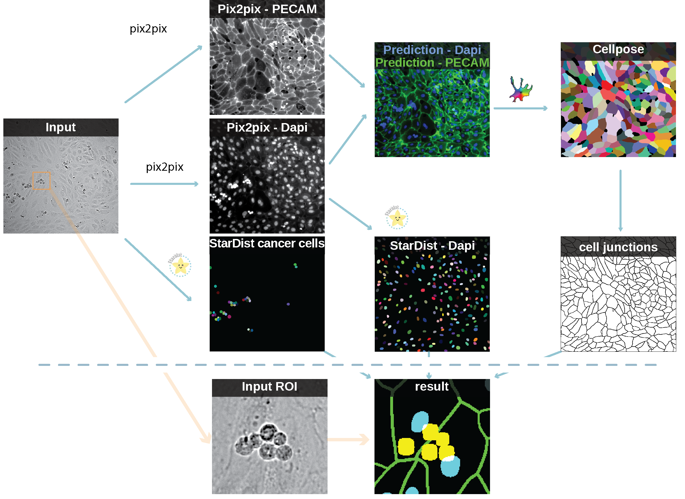

# Deep Learning-based Image Analysis Pipeline

This repository contains the documentation for a deep learning-based image analysis pipeline designed for processing videos of circulating cells attaching to endothelial monolayers. The entire process is encapsulated within a Google Colab notebook, which provides a straightforward, accessible platform for conducting the analysis.

This pipeline is based on and combines multiple notebooks from the [ZeroCostDL4Mic](https://github.com/HenriquesLab/ZeroCostDL4Mic) project, a collection of Jupyter notebooks aimed at enabling users to apply deep learning models to their microscopy images without any cost.

## Overview

The pipeline leverages multiple deep-learning models to process raw microscopy videos, segmenting circulating cells and identifying endothelial cell nuclei and junctions. It utilizes state-of-the-art models like StarDist for segmentation and pix2pix for artificial labeling.

The processed data offer insights into cell attachment dynamics, facilitating advanced biological research. 

- 

**Important Consideration:** Due to the substantial size of the dataset discussed in the paper, reanalysis using the free version of Google Colab may be constrained by memory and processing limitations. 

## Deep Learning Models and Dataset

A comprehensive list of deep learning models and the training dataset utilized in this pipeline can be found [here](https://github.com/CellMigrationLab/PDAC_DL?tab=readme-ov-file#pdac_dl).

## Pipeline Steps

1. **Video Pre-processing**:
   - The raw microscopy videos are manually cropped into 2-minute segments, each containing 2500 frames.

2. **Cell Segmentation**:
   - Circulating cells are segmented from the brightfield images at every frame using dedicated StarDist models.

3. **Frame Selection**:
   - Brightfield frames are scored to identify those with the best contrast.
   - The top 25% of frames are selected for further processing.

4. **Artificial Labeling**:
   - The selected frames undergo artificial labeling to predict nuclei (simulating Dapi staining) and junctions (simulating PECAM-1 staining) using dedicated pix2pix models.

5. **Image Summation**:
   - Predictions from all frames are summed to generate a single image for each video segment.

6. **Nuclei Segmentation**:
   - From the artificially labeled nuclei images, the nuclei of endothelial cells are segmented using a dedicated StarDist Model.

7. **Endothelial Cell Segmentation**:
   - The fake nuclei and junction images are merged and used to segment endothelial cells with the Cellpose (Cyto2 model).

8. **Outline Generation**:
   - The outlines of endothelial cells are generated from the predicted masks. This step is performed using [pyclesperanto](https://github.com/clEsperanto/pyclesperanto/)

## Usage

To use this pipeline, follow the instructions in the [Google Colab notebook](LINK). The notebook guides you through the process, from video pre-processing to the final segmentation and analysis.

If you need any more help or questions, please open an issue in this repository.

## Contribution

Contributions to improve the pipeline or extend its capabilities are welcome. Please submit a pull request or open an issue to discuss potential changes or additions.

## License

This project is licensed under the MIT License - see the [LICENSE](LICENSE) file for details.

## Acknowledgments

We thank all contributors to the deep learning models and software used in this pipeline, including the developers of StarDist, pix2pix, and Cellpose. Special thanks to the ZeroCostDL4Mic team for providing an accessible platform to integrate deep learning into microscopy image analysis. Their work has significantly advanced the field of image analysis.
